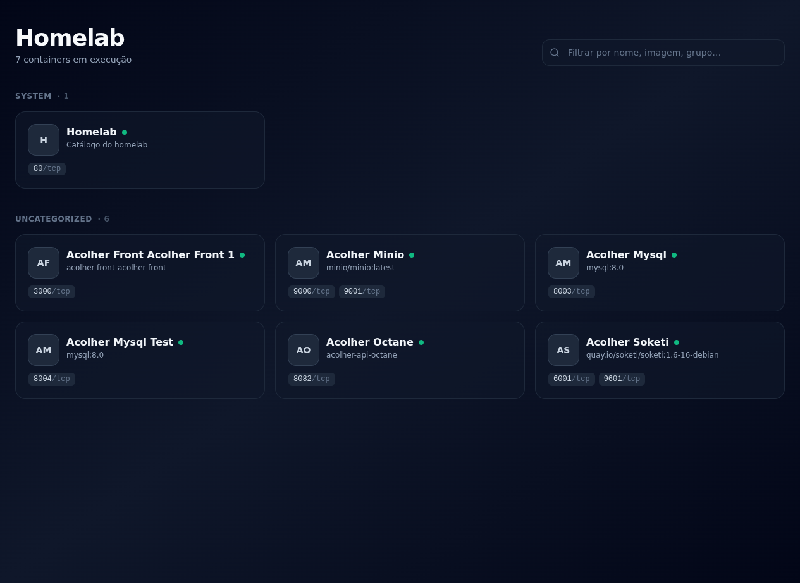

<h1 align="center">🏠 Homelab Dashboard</h1>

<p align="center">
  Um catálogo bonito, leve e <em>plug & play</em> pra acessar todos os containers Docker do seu homelab em um clique.
</p>

<p align="center">
  
  
  
  
  
</p>

<p align="center">
  
</p>

---

## ✨ Features

- 🔍 **Auto-descoberta** — lista todo container Docker em execução, sem precisar cadastrar nada.
- 🏷️ **Customização via labels** — dê nome bonito, ícone, descrição e grupo aos seus serviços direto no `docker-compose.yml`.
- 🌐 **Host-aware** — funciona sem config em **LAN, Tailscale ou hostname** simultaneamente: a URL dos cards usa o mesmo host que você usou pra abrir o dashboard.
- ✏️ **Modo edição na UI** — arraste pra reordenar, esconda cards e edite nome/ícone/descrição/grupo/URL/porta de cada container num modal. Persiste em `data/settings.json` (sem banco).
- 🎯 **Filtro instantâneo** — busque por nome, imagem, descrição ou grupo.
- 📦 **Agrupamento** — cards organizados por categoria (Media, Database, System…).
- 🔄 **Auto-refresh** — recarrega a lista a cada 10s (configurável).
- 🟢 **Status visual** — indicador de saúde por container (`running`, `healthy`, etc.).
- 🪶 **Container único** — Nuxt 3 + Nitro num único processo, imagem `node:alpine` enxuta.

---

## 🚀 Quick Start

> Pré-requisito: Docker + Docker Compose na máquina.

```bash
# 1. Clone o repositório no seu homelab
git clone <seu-fork-ou-repo> homelab
cd homelab

# 2. Suba o dashboard
docker compose up -d --build
```

Pronto. Acesse:

| De onde | URL |
| ------- | --- |
| 🏠 LAN | `http://<IP-do-homelab>/` |
| 🌐 Tailscale | `http://100.x.x.x/` ou `http://<machine>.tail-xxx.ts.net/` |
| 💻 Local | `http://localhost/` |

Os links dos cards são montados no client-side com `window.location.hostname` — então **o mesmo container** funciona seja qual for o caminho de acesso.

---

## 🏷️ Customizando containers via labels

Adicione labels ao `docker-compose.yml` de qualquer app pra personalizar o card. **Tudo é opcional** — o dashboard funciona sem nenhuma label.

```yaml
services:
  plex:
    image: linuxserver/plex
    ports:
      - "32400:32400"
    labels:
      homelab.name: "Plex"
      homelab.description: "Servidor de mídia"
      homelab.icon: "https://cdn.jsdelivr.net/gh/walkxcode/dashboard-icons/png/plex.png"
      homelab.group: "Media"
      homelab.url: "https://plex.meudominio.com"
```

### Referência

| Label | Tipo | Padrão | Descrição |
|-------|------|--------|-----------|
| `homelab.enable` | `"true"` \| `"false"` | `"true"` | `"false"` esconde o container do dashboard. |
| `homelab.name` | string | nome do container | Nome exibido no card. |
| `homelab.description` | string | nome da imagem | Linha de descrição embaixo do nome. |
| `homelab.icon` | URL | iniciais | Ícone do card. Pode ser PNG/SVG hospedado em qualquer lugar. |
| `homelab.group` | string | `Uncategorized` | Agrupa cards pela mesma categoria. |
| `homelab.url` | URL completa | auto | Sobrescreve a URL clicável. Use quando o serviço fica atrás de domínio ou outra porta. |

### Ícones bonitos de graça

O projeto [walkxcode/dashboard-icons](https://github.com/walkxcode/dashboard-icons) tem PNG/SVG de centenas de apps populares:

```yaml
labels:
  homelab.icon: "https://cdn.jsdelivr.net/gh/walkxcode/dashboard-icons/png/sonarr.png"
```

### Exemplos prontos

<details>
<summary><strong>📺 Plex / Jellyfin</strong></summary>

```yaml
labels:
  homelab.name: "Jellyfin"
  homelab.description: "Streaming de mídia"
  homelab.icon: "https://cdn.jsdelivr.net/gh/walkxcode/dashboard-icons/png/jellyfin.png"
  homelab.group: "Media"
```
</details>

<details>
<summary><strong>🗄️ MinIO</strong></summary>

```yaml
labels:
  homelab.name: "MinIO"
  homelab.description: "Object storage S3-compatible"
  homelab.icon: "https://cdn.jsdelivr.net/gh/walkxcode/dashboard-icons/png/minio.png"
  homelab.group: "Storage"
  homelab.url: "http://homelab.local:9001"   # console fica na 9001, não na 9000
```
</details>

<details>
<summary><strong>🐬 MySQL (sem UI web — esconda do dashboard)</strong></summary>

```yaml
labels:
  homelab.enable: "false"
```
</details>

---

## ✏️ Modo edição

Clique em **Editar** no header pra:

- **Arrastar e soltar** cards pra reordenar dentro de cada grupo (drag-and-drop).
- **Esconder/mostrar** containers (ícone de olho no canto do card).
- **Personalizar tudo** clicando na engrenagem ⚙️ do card — abre um modal pra editar:
  - **Nome** exibido
  - **Descrição**
  - **Ícone** (URL — funciona com [dashboard-icons](https://github.com/walkxcode/dashboard-icons))
  - **Grupo** (move o card entre grupos; criar grupo novo é só digitar)
  - **URL custom** (sobrescreve a auto-detecção)
  - **Porta** (útil pra `network_mode: host` ou pra escolher entre múltiplas portas expostas)

> Qualquer override em branco volta ao default (label do container ou auto-detectado).

Tudo é salvo automaticamente em `./data/settings.json` no host. Sem banco, sem mágica:

```json
{
  "order": ["plex", "sonarr", "homelab"],
  "containers": {
    "mysql-test": { "hidden": true },
    "minio":      { "port": 9001 },
    "octane":     {
      "name": "Octane API",
      "icon": "https://cdn.jsdelivr.net/gh/walkxcode/dashboard-icons/png/laravel.png",
      "group": "Backend"
    }
  }
}
```

**Prioridade**: override da UI > label `homelab.*` no compose > default (auto-detectado).

A chave é o **nome real do container** Docker — estável entre recreates. Você pode editar esse arquivo na mão se quiser; o dashboard pega na próxima request.

> 💡 **Backup**: o `data/` é um diretório no host. Copie pra qualquer lugar pra fazer backup das suas preferências.

---

## ⚙️ Variáveis de ambiente

Definidas no `docker-compose.yml`:

| Variável | Padrão | Descrição |
|----------|--------|-----------|
| `HOMELAB_REFRESH_MS` | `10000` | Intervalo (ms) em que o frontend recarrega a lista. `0` desativa. |
| `HOMELAB_DATA_DIR` | `/app/data` | Pasta dentro do container onde `settings.json` é gravado (precisa de bind mount). |
| `DOCKER_SOCKET` | `/var/run/docker.sock` | Caminho do socket Docker dentro do container. |

---

## 🛠️ Desenvolvimento local

```bash
# Instalar dependências
npm install

# Rodar em modo dev (hot reload na :3000)
npm run dev

# Build produção
npm run build
node .output/server/index.mjs
```

> ⚠️ Em dev, o Nuxt tenta abrir `/var/run/docker.sock` na sua máquina local. Garanta que o Docker está rodando.

---

## 📁 Estrutura

```
homelab/
├── app.vue                       # Root da aplicação
├── pages/
│   └── index.vue                 # Catálogo (filtro, edit mode, drag-and-drop)
├── components/
│   └── ContainerCard.vue         # Card individual
├── composables/
│   └── useHomelabSettings.ts     # Load/save settings (debounced PUT)
├── server/
│   ├── api/
│   │   ├── containers.get.ts     # Lê Docker socket + merge settings
│   │   ├── settings.get.ts       # Retorna settings persistidas
│   │   └── settings.put.ts       # Salva settings
│   └── utils/
│       ├── docker.ts             # Cliente dockerode (singleton)
│       └── settings.ts           # Read/write JSON com cache em memória
├── types/
│   ├── container.ts              # Tipo do container
│   └── settings.ts               # Schema das settings
├── data/                         # (bind mount) settings.json mora aqui
├── assets/css/tailwind.css
├── nuxt.config.ts
├── tailwind.config.js
├── Dockerfile                    # Multi-stage: build → node:alpine
└── docker-compose.yml            # 80:3000 + docker.sock + ./data
```

---

## 🧠 Como funciona

```
┌─────────────────────┐         ┌──────────────────────┐
│   Browser (você)    │  HTTP   │   Container homelab  │
│                     │ ─────▶  │                      │
│  - filter / cards   │  :80    │   Nuxt + Nitro       │
│                     │         │   ↓                  │
│  builds URLs with   │         │   dockerode          │
│  window.location.   │         │   ↓                  │
│  hostname           │         │   /var/run/          │
│                     │         │     docker.sock      │
└─────────────────────┘         └──────────┬───────────┘
                                           │
                                           │ lista containers
                                           ▼
                                  ┌────────────────────┐
                                  │  Docker daemon do  │
                                  │  host (homelab)    │
                                  └────────────────────┘
```

1. **Backend (Nitro)**: `server/api/containers.get.ts` chama `docker.listContainers()` via socket montado read-only no container, extrai labels `homelab.*` e devolve JSON.
2. **Frontend (Vue 3)**: faz `useFetch('/api/containers')` no client, refresca a cada `HOMELAB_REFRESH_MS`, filtra/agrupa, renderiza cards.
3. **Resolução de URL**: o card monta `http://${window.location.hostname}:${port}` no client. Acessou via Tailscale? Os links vão por Tailscale. Acessou via LAN? Vão pela LAN. Sem mágica, sem env var.

---

## 🔒 Segurança

O dashboard monta `/var/run/docker.sock` em **read-only** (`:ro`). Ele só **lê** a lista de containers — não pode startar, parar, executar comandos, nem criar containers. Mesmo assim:

- **Não exponha** este dashboard direto na internet pública.
- Acesso externo deve passar por VPN (Tailscale, Wireguard) ou reverse proxy autenticado.
- Read-only ≠ inofensivo: labels e nomes de containers podem revelar topologia interna.

---

## 🗺️ Roadmap

- [x] Persistir preferências (ordem / hide) em JSON local
- [x] Drag-and-drop pra reordenar
- [ ] Suporte a containers parados (badge cinza + ação de start)
- [ ] Health check visual baseado no `HEALTHCHECK` do Docker
- [ ] Modo claro / dark toggle
- [ ] Suporte a múltiplos hosts Docker (via TCP / DOCKER_HOST remoto)
- [ ] Renomear container pela UI (sobrescreve `homelab.name`)

PRs e ideias são bem-vindas.
